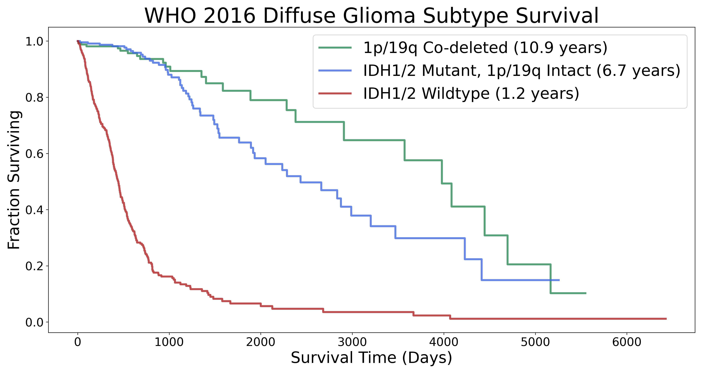
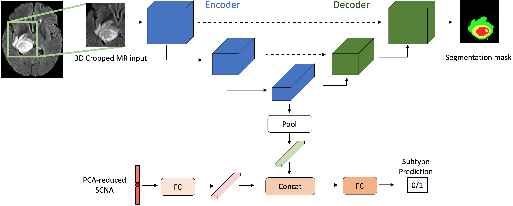

# Leveraging Unlabeled Data for Glioma Molecular Subtype and Survival Prediction

---


## Introduction

Gliomas make up 80\% of all primary malignant brain tumors in adults. The 2016 World Health Organization (WHO) criteria organizes diffuse gliomas into broad, survival-stratifying subtypes based on the mutation status of the genes IDH1 and IDH2 and the co-deletion status of whole chromosome arms 1p and 19q.



We use a multi-task learning system to learn IDH mutations, 1p/19q co-deletions, and survival from a combination of labeled and unlabeled magnetic resonance (MR) imaging data along with somatic copy number alteration (SCNA) data. Our model uses tumor segmentation as an auxiliary learning task.


## Data

We use glioma MR data from the 2018 Multimodal Brain Tumor Segmentation Challenges (BraTS) and glioma SCNA data from The Cancer Genome Atlas (TCGA). 

Multi-parametric MR data were downloaded for 542 patients from the [2018 BraTS training, validation, and testing datasets](https://www.med.upenn.edu/sbia/brats2018/data.html). Gene-level SCNA data were downloaded for 1090 patients in the the TCGA lower-grade (WHO grade II/III) glioma and glioblastoma (WHO grade IV) projects from the University of California Santa Cruz cancer browser (https://genome-cancer.ucsc.edu/).

There are 235 patients in the intersection of the BraTS MR dataset and the TCGA glioma SCNA dataset. All of these patients have overall survival (OS) and 1p/19q co-deletion labels, while only 171 have IDH labels. We use the 160 patients in the BraTS 2018 training set with SCNA data in the TCGA as a training set; we use the 75 patients in the BraTS 2018 validation and testing sets with SCNA data as a validation set. Of the 160 patients in our training set, 112 have IDH labels; of the 75 patients in our training set, 59 have IDH labels.


The BraTS MR data are 4-channel volumes composed of pre- (T1) and post-contrast (T1ce) T1-weighted modalities and T2-weighted (T2) and T2 Fluid-Attenuated Inversion Recovery (FLAIR) modalities (**A**).  Each MR sample has dimension $4 \times 240 \times 240 \times 155$ where each channel represents a modality. The hallmark enhancing ring of aggressive tumors is clearly visible on the T1ce modality.

Four-class segmentation masks (**B**) are provided for the 285 patients in the BraTS training set. The outer class consists of peritumoral edema; the inner classes consist of necrotic tissue, non-enhancing tumor, and enhancing tumor. 

Panel **C)** shows the distribution of labels in the combined 2018 BraTS and TCGA glioma SCNA datasets. The labeled training set is outlined with a red boundary; the validation set is outlined in a gold boundary; the unlabeled MR data leveraged by our MTL model is outlined with a blue boundary; the set of samples with SCNA data but without MR data is outlined with a green boundary.


## Training on the 2018 BraTS and TCGA glioma SCNA datasets
---
### Data preparation
1. Download MRI data from the training, testing, and validation data from the 2018 BraTS Challenge [here](https://www.med.upenn.edu/sbia/brats2018/data.html) (registration and challenge entry may be necessary).   
2. Download or train a glioma tumor segmentation network. We begin by assigning weak segmentation labels to patients without a ground truth segmentation mask by using a segmentation network pretrained on a BraTS computation. We used [3D-ESPNet](https://github.com/sacmehta/3D-ESPNet), but we recommend a more accurate segmentation network that benchmarked high on a recent BraTS competition.
3. Place all BraTS data in a single directory, i.e., ```all_brats_scans```. This directory should include 467 folders, each of which should contain four MR modalities and a segmentation mask.
4. Download SCNA data for gliomas in the TCGA [here](https://xenabrowser.net/datapages/?dataset=TCGA.GBMLGG.sampleMap%2FGistic2_CopyNumber_Gistic2_all_thresholded.by_genes&host=https%3A%2F%2Ftcga.xenahubs.net&removeHub=https%3A%2F%2Fxena.treehouse.gi.ucsc.edu%3A443). Note: these data are aligned to ``hg19``. Gene-level SCNA GISTIC2.0 score data aligned to ``hg38`` are also available from UCSC. 
5. Optionally reduce SCNA dimension using PCA, MGL, MDS, t-SNE, UMAP, etc.

### IDH / 1p/19q Classification
1. Choose classification task (IDH or 1p/19q)
2. Choose MR input format (number of channels, cropped/not-cropped).
3. Train network as shown in the classification example notebook.

### Survival prediction
1. Train MTL network on the IDH prediction task.
2. Represent each patient with the last-layer embedding of the classification branch in the MTL network.
3. Train a linear Cox-Porortal Hazard model on this representation.

## Network



Our MTL model uses the architecture of 3D-ESPNet with a classification branch connected to the output of the encoder. If desired, SCNA data can be passed though fully connected layers, concatenated with the average-pooled encoder output, and fed into a classifier to predict subtype class. The network decoder also produces a segmentation mask. We take the weighted cross-entropy loss of the subtype classification and tumor segmentation tasks. Our model accepts full brain multi-model MR volumes as well as cropped tumor volumes (shown here). Networks can also be trained on 1-channel, single-modality input.

For training details and experimental results, see paper.